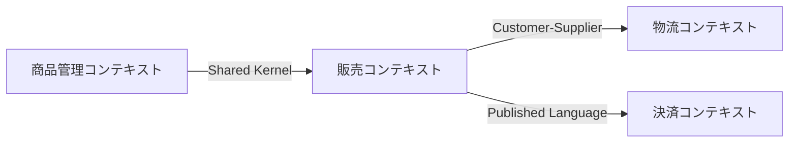

# DDD Bounded Context Analysis Skill

## Background Philosophy

### Language Games × DDD

In §43 of *Philosophical Investigations*, Wittgenstein stated: "The meaning of a word is its use in the language."
The same word can have different meanings depending on the context — who uses it and for what purpose. This concept
of "language games" is deeply connected to DDD's Bounded Context.

**Core principle:** Ask not "What does this word mean?" but "How is this word being used?"

### @MinoDriven (Daiya Seba) Approach

Derive context boundaries starting from the **purpose** of actors:

- **Layer 1: Actor** — Who uses the system
- **Layer 2: Purpose** — What the actor wants to achieve → determines the "context" of the language game
- **Layer 3: Rules** — Different purposes lead to different rules applied to the same terms

**One context = a set of [Actor, Purpose, Rules]**

---

## Execution Steps

### Phase 1: Domain Understanding (Input Collection)

**Goal:** Understand the target domain.

1. Confirm with the user:
   - Overview of the target system/domain
   - Availability of existing documents (requirements, user stories, etc.)
   - Availability of existing codebase

2. If existing code is available:
   - Investigate directory structure (`Glob`, `Read`)
   - Identify domain models/entities (`Grep` to search for key classes/types)
   - Collect existing naming patterns

3. If domain knowledge is insufficient:
   - Research industry terms and standard business processes via `WebSearch` / `WebFetch`

### Phase 2: Actor Identification

**Goal:** Enumerate all actors and their purposes.

1. Discover actors:
   - Human actors (end users, administrators, operators, etc.)
   - System actors (external systems, batch processes, etc.)

2. Define each actor's purpose:
   - Use the format: "As [actor], in order to [purpose], I want to [action]"
   - One actor may have multiple purposes → each may constitute a different language game

3. Output format:

```markdown
| アクター | 目的 | 主要なアクション |
|----------|------|------------------|
| 購入者   | 欲しい商品を見つけて購入する | 商品検索、カート追加、注文 |
| 出品者   | 商品を販売して利益を得る | 商品登録、在庫管理、売上確認 |
```

### Phase 3: Language Game Analysis

**Goal:** Discover points where the same term has different meanings depending on actor/purpose.

1. **Term collection:** List all major nouns and verbs from Phase 2

2. **Find semantic divergence points:** For each term, ask:
   - Which actors use this term?
   - What is each actor's purpose?
   - When purposes differ, how do the term's meaning (attributes, behavior, rules) change?

3. **Create a language game analysis table:**

```markdown
| 用語 | アクター | 目的 | この文脈での意味 | 主要な属性/ルール |
|------|----------|------|------------------|-------------------|
| 商品 | 購入者   | 購入 | 購入対象（価格、レビュー、在庫有無） | 価格表示ルール、在庫チェック |
| 商品 | 出品者   | 販売 | 販売資産（原価、利益率、在庫数） | 価格設定ルール、在庫補充閾値 |
| 商品 | 物流担当 | 配送 | 配送対象（重量、サイズ、配送区分） | 梱包ルール、配送料計算 |
```

4. **Confirm divergence:** If meanings clearly differ → candidate for different contexts

> **Important:** Refer to `references/language-game-guide.md` for detailed analysis methods.

### Phase 4: Context Boundary Definition

**Goal:** Formally define each bounded context.

1. Group context candidates based on Phase 3 results:
   - Same actor × same purpose × same rule set → one context
   - Avoid over-splitting (prioritize cohesion)

2. Define each context:

```markdown
## コンテキスト: [名前]

- **アクター:** [主要アクター]
- **目的:** [このコンテキストが果たす目的]
- **ユビキタス言語:**
  | 用語 | このコンテキストでの定義 |
  |------|--------------------------|
  | 商品 | 購入者が閲覧・購入する対象。価格、レビュー、在庫状態を持つ |
- **主要ビジネスルール:**
  - [ルール1]
  - [ルール2]
- **主要モデル（エンティティ/値オブジェクト）:**
  - [モデル1]: [説明]
```

3. Use the template from `references/context-analysis-template.md`.

### Phase 5: Context Relationship Definition (Context Map)

**Goal:** Define relationships and integration patterns between contexts.

1. Identify inter-context relationships:
   - Which context needs data from which other context
   - Direction of data flow

2. Select integration patterns:

| Pattern | Use case |
|---------|----------|
| Shared Kernel | Two contexts are tightly coupled with a small shared part |
| Customer-Supplier | Upstream serves downstream's needs |
| Conformist | Downstream conforms to upstream's model as-is |
| Anti-Corruption Layer | Integration with external/legacy systems |
| Published Language | Integration via standardized interfaces |
| Separate Ways | No integration needed |

3. Output the context map in Mermaid format:



---

## Output Format

Save analysis results at the following path:

```text
<project>/docs/ddd/
├── context-map.md              # Context map (overview)
├── contexts/
│   ├── <context-name-1>.md     # Each context's details (using template)
│   ├── <context-name-2>.md
│   └── ...
└── language-games.md           # Language game analysis table (Phase 3 deliverable)
```

- `context-map.md`: Mermaid diagram + description of inter-context relationships
- `contexts/<name>.md`: Each context definition based on `references/context-analysis-template.md`
- `language-games.md`: Term semantic divergence analysis

---

## Important Notes

1. **Don't aim for perfection:** Bounded contexts are refined iteratively. The first analysis doesn't need perfect boundaries.

2. **Start from actor purposes:** Derive boundaries from business purposes, not technical concerns (databases, APIs).

3. **Matching terms may be coincidental:** The same name doesn't necessarily mean the same concept. Always verify "who uses it and for what purpose."

4. **Mismatching terms may also be coincidental:** Different names may still refer to the same concept within a context.

5. **Respect existing code:** If a codebase exists, explicitly show the gap between ideal boundaries and actual code structure, and suggest an incremental migration strategy.

6. **Prioritize dialogue with users:** The domain expert is the user. Always confirm uncertainties during analysis.
