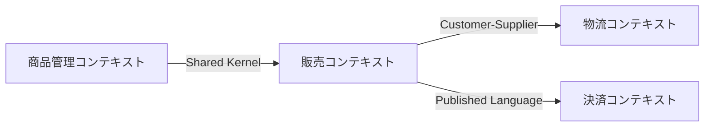

# DDD 境界付けられたコンテキスト分析スキル

## 背景思想

### 言語ゲーム × DDD

ヴィトゲンシュタインは『哲学探究』第43節で「語の意味とは、言語におけるその使用である」と述べた。
同じ単語でも、使われる文脈（誰が・何の目的で使うか）によって意味が変わる。この「言語ゲーム」の
考え方は、DDDの「境界付けられたコンテキスト（Bounded Context）」と深く結びつく。

**核心原則:** 「この言葉はどういう意味ですか？」ではなく「この言葉をどう使っていますか？」と問う。

### @MinoDriven（仙塲大也）氏の手法

アクターの**目的**を起点にコンテキスト境界を導出する:

- **第1層: アクター（Actor）** — 誰がシステムを使うか
- **第2層: 目的（Purpose）** — アクターが何を達成したいか → 言語ゲームの「文脈」を決定
- **第3層: ルール（Rule）** — 目的が異なれば同じ言葉でも適用されるルールが異なる

**1つのコンテキスト = [アクター, 目的, ルール群] のセット**

---

## 実行手順

### Phase 1: ドメイン理解（入力収集）

**目標:** 分析対象のドメインを理解する。

1. ユーザーに以下を確認する:
   - 分析対象のシステム/ドメインの概要
   - 既存のドキュメント（要件定義書、ユーザーストーリー等）の有無
   - 既存コードベースの有無

2. 既存コードがある場合:
   - ディレクトリ構造を調査（`Glob`, `Read`）
   - ドメインモデル/エンティティを特定（`Grep` で主要クラス/型を検索）
   - 既存の命名パターンを収集

3. ドメイン知識が不足している場合:
   - `WebSearch` / `WebFetch` で業界用語や標準的なビジネスプロセスを調査

### Phase 2: アクターの特定

**目標:** システムに関わるすべてのアクターとその目的を列挙する。

1. アクターを洗い出す:
   - 人間のアクター（エンドユーザー、管理者、オペレーター等）
   - システムアクター（外部システム、バッチ処理等）

2. 各アクターの目的を定義する:
   - 「〜として、〜のために、〜したい」形式で記述
   - 1つのアクターが複数の目的を持つことがある → それぞれ別の言語ゲームになりうる

3. 出力形式:

```markdown
| アクター | 目的 | 主要なアクション |
|----------|------|------------------|
| 購入者   | 欲しい商品を見つけて購入する | 商品検索、カート追加、注文 |
| 出品者   | 商品を販売して利益を得る | 商品登録、在庫管理、売上確認 |
```

### Phase 3: 言語ゲームの分析

**目標:** 同じ用語がアクター/目的によって異なる意味を持つポイントを発見する。

1. **用語収集:** Phase 2 で出てきた主要な名詞・動詞を一覧化する

2. **意味の分岐点を探す:** 各用語について以下を問う:
   - この用語を使うアクターは誰か？
   - そのアクターの目的は何か？
   - 目的が異なるとき、この用語の意味（属性、振る舞い、ルール）はどう変わるか？

3. **言語ゲーム分析表の作成:**

```markdown
| 用語 | アクター | 目的 | この文脈での意味 | 主要な属性/ルール |
|------|----------|------|------------------|-------------------|
| 商品 | 購入者   | 購入 | 購入対象（価格、レビュー、在庫有無） | 価格表示ルール、在庫チェック |
| 商品 | 出品者   | 販売 | 販売資産（原価、利益率、在庫数） | 価格設定ルール、在庫補充閾値 |
| 商品 | 物流担当 | 配送 | 配送対象（重量、サイズ、配送区分） | 梱包ルール、配送料計算 |
```

4. **分岐の確認:** 意味が明確に異なる場合 → 異なるコンテキストの候補

> **重要:** 分析の詳細な手法については `references/language-game-guide.md` を参照すること。

### Phase 4: コンテキスト境界の定義

**目標:** 各境界付けられたコンテキストを正式に定義する。

1. Phase 3 の分析結果をもとに、コンテキスト候補をグループ化する:
   - 同じアクター × 同じ目的 × 同じルール群 → 1つのコンテキスト
   - 無理に分割しすぎない（凝集度を重視）

2. 各コンテキストを定義する:

```markdown
## コンテキスト: [名前]

- **アクター:** [主要アクター]
- **目的:** [このコンテキストが果たす目的]
- **ユビキタス言語:**
  | 用語 | このコンテキストでの定義 |
  |------|--------------------------|
  | 商品 | 購入者が閲覧・購入する対象。価格、レビュー、在庫状態を持つ |
- **主要ビジネスルール:**
  - [ルール1]
  - [ルール2]
- **主要モデル（エンティティ/値オブジェクト）:**
  - [モデル1]: [説明]
```

3. テンプレートは `references/context-analysis-template.md` を使用する。

### Phase 5: コンテキスト間の関係定義（コンテキストマップ）

**目標:** コンテキスト間の関係性と統合パターンを定義する。

1. コンテキスト間の関係を特定する:
   - どのコンテキストがどのコンテキストのデータを必要とするか
   - データの流れの方向性

2. 統合パターンを選択する:

| パターン | 使用場面 |
|----------|----------|
| Shared Kernel | 2つのコンテキストが密結合で共有部分が小さい場合 |
| Customer-Supplier | 上流が下流のニーズに応える関係 |
| Conformist | 下流が上流のモデルにそのまま従う |
| Anti-Corruption Layer | 外部/レガシーシステムとの統合 |
| Published Language | 標準化されたインターフェースで統合 |
| Separate Ways | 統合の必要がない |

3. コンテキストマップを Mermaid 形式で出力する:



---

## 出力形式

分析結果は以下のパスに保存する:

```text
<project>/docs/ddd/
├── context-map.md              # コンテキストマップ（全体像）
├── contexts/
│   ├── <context-name-1>.md     # 各コンテキストの詳細（テンプレート使用）
│   ├── <context-name-2>.md
│   └── ...
└── language-games.md           # 言語ゲーム分析表（Phase 3 の成果物）
```

- `context-map.md`: Mermaid 図 + コンテキスト間関係の説明
- `contexts/<name>.md`: `references/context-analysis-template.md` に基づく各コンテキストの定義
- `language-games.md`: 用語の意味の分岐分析

---

## 重要な注意事項

1. **完璧を目指さない:** 境界付けられたコンテキストは反復的に洗練されるもの。最初の分析で完璧な境界を引く必要はない。

2. **アクターの目的から始める:** 技術的な関心（データベース、API）からではなく、ビジネス上の目的から境界を導出する。

3. **用語の一致は偶然かもしれない:** 同じ名前が使われているからといって同じ概念とは限らない。必ず「誰が・何のために使うか」を確認する。

4. **用語の不一致も偶然かもしれない:** 異なる名前が使われていても、同じコンテキスト内の同じ概念かもしれない。

5. **既存コードを尊重する:** 既にコードベースがある場合、理想的な境界と現実のコード構造のギャップを明示し、段階的な移行戦略を提案する。

6. **ユーザーとの対話を重視する:** ドメインエキスパートはユーザー自身。分析中に不明点があれば必ず確認する。
